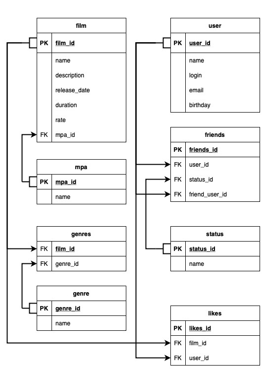

# java-filmorate
Template repository for Filmorate project.

# database-filmorate

# Примеры запросов
User:
1. Создание нового пользователя: POST http://localhost:8080/users, в Request Body json с данными пользователя.
2. Обновление пользователя: PUT http://localhost:8080/users, в Request Body json с данными пользователя.
3. Получние списка пользователей: GET http://localhost:8080/users.
4. Получние пользователя по id: GET http://localhost:8080/users/{id}.

Film:
1. Создание нового фильма: POST http://localhost:8080/films, в Request Body json с данными фильма.
2. Обновление фильма: PUT http://localhost:8080/films, в Request Body json с данными фильма.
3. Получние списка фильмов: GET http://localhost:8080/films.
4. Получние фильма по id: GET http://localhost:8080/films/{id}.

Friends:
1. Получние списка друзей пользователя: GET http://localhost:8080/users/{id}/friends.
2. Получние списка общих друзей с другим пользователем: GET http://localhost:8080/users/{id}/friends/common/{friendId}.
3. Добавление в друзья: PUT http://localhost:8080/users/{id}/friends/{friendId}.
4. Удаление пользователя из списка друзей: DELETE http://localhost:8080/users/{id}/friends/{friendId}.

Like:
1. Поставить лайк фильму: PUT http://localhost:8080/films/{filmId}/like/{userId}.
2. Убрать лайк у фильма: DELETE http://localhost:8080/films/{filmId}/like/{userId}.
3. Получить списко популярных фильмов: GET http://localhost:8080/films/popular.

# Пример запроса к БД
1. Получение всех фильмов: "select * from films"
2. Получение всех Пользователей: "select * from users"
3. Получение всех жанров: "select * from gerne"
4. Получение всех вариантов рейтинг: "select * from mpa"